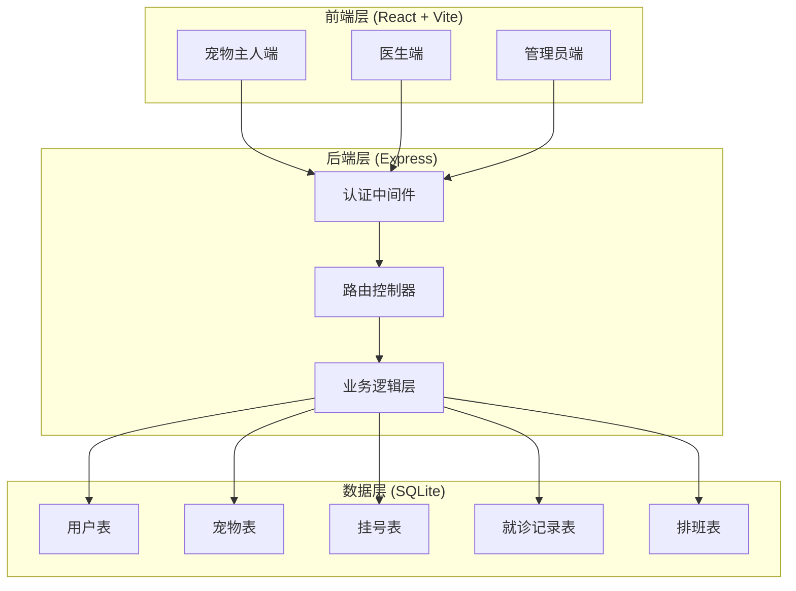
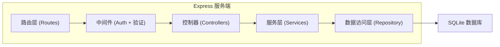
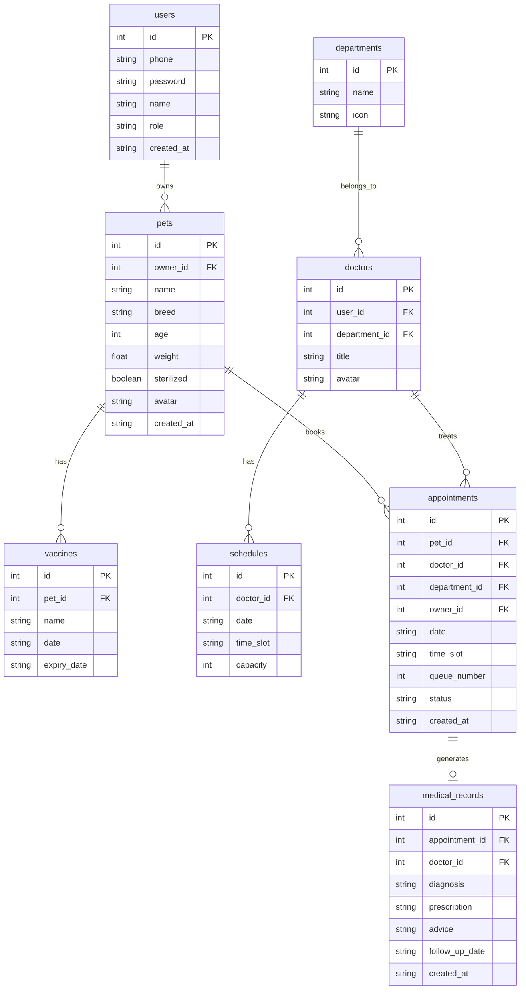

## 1. 架构设计



## 2. 技术说明

- 前端：React@18 + Tailwind CSS@3 + Vite
- 初始化工具：Vite
- 后端：Express@4
- 数据库：SQLite（better-sqlite3），适合轻量级全栈应用
- 认证：JWT (jsonwebtoken)
- 图表：Recharts（管理员数据可视化）
- 路由：React Router@6
- 状态管理：React Context + useReducer

## 3. 路由定义

| 路由 | 用途 |
|------|------|
| / | 首页/登录注册 |
| /register | 宠物主人注册 |
| /pets | 宠物档案列表 |
| /pets/new | 添加宠物 |
| /pets/:id/edit | 编辑宠物 |
| /appointment | 挂号预约（选科室） |
| /appointment/doctor | 选医生 |
| /appointment/slot | 选时段 |
| /appointment/confirm | 确认挂号 |
| /appointment/:id | 挂号单详情 |
| /profile | 个人中心 |
| /profile/records | 病历时间线 |
| /profile/reminders | 提醒中心 |
| /doctor | 医生工作台 |
| /doctor/appointment/:id | 患者详情与就诊 |
| /admin | 管理员仪表盘 |
| /admin/schedule | 排班管理 |
| /admin/settings | 号源设置 |

## 4. API 定义

### 4.1 认证相关

```typescript
POST /api/auth/register
Request: { phone: string; password: string; name: string }
Response: { token: string; user: { id: number; role: "owner" } }

POST /api/auth/login
Request: { phone: string; password: string }
Response: { token: string; user: { id: number; role: string; name: string } }
```

### 4.2 宠物档案

```typescript
GET /api/pets
Response: Pet[]

POST /api/pets
Request: { name: string; breed: string; age: number; weight: number; sterilized: boolean; vaccines: Vaccine[] }

PUT /api/pets/:id
Request: Partial<Pet>

DELETE /api/pets/:id
Response: { success: boolean }

interface Pet {
  id: number;
  ownerId: number;
  name: string;
  breed: string;
  age: number;
  weight: number;
  sterilized: boolean;
  avatar?: string;
  createdAt: string;
}

interface Vaccine {
  id: number;
  petId: number;
  name: string;
  date: string;
  expiryDate: string;
}
```

### 4.3 挂号预约

```typescript
GET /api/departments
Response: Department[]

GET /api/departments/:id/doctors
Response: Doctor[]

GET /api/doctors/:id/slots?date=YYYY-MM-DD
Response: TimeSlot[]

POST /api/appointments
Request: { petId: number; departmentId: number; doctorId: number; date: string; timeSlot: string }
Response: { appointmentId: number; queueNumber: number; estimatedWait: string }

GET /api/appointments/:id
Response: Appointment

interface Department {
  id: number;
  name: string;
  icon: string;
}

interface Doctor {
  id: number;
  name: string;
  title: string;
  departmentId: number;
  avatar?: string;
}

interface TimeSlot {
  time: string;
  available: boolean;
  remaining: number;
}

interface Appointment {
  id: number;
  queueNumber: number;
  pet: Pet;
  department: Department;
  doctor: Doctor;
  date: string;
  timeSlot: string;
  status: "waiting" | "in_progress" | "completed" | "cancelled";
  estimatedWait: string;
}
```

### 4.4 就诊记录

```typescript
GET /api/appointments/:id/record
Response: MedicalRecord

POST /api/appointments/:id/record
Request: { diagnosis: string; prescription: PrescriptionItem[]; advice: string; followUpDate?: string }
Response: { success: boolean }

interface MedicalRecord {
  id: number;
  appointmentId: number;
  diagnosis: string;
  prescription: PrescriptionItem[];
  advice: string;
  followUpDate?: string;
  createdAt: string;
  doctor: Doctor;
}

interface PrescriptionItem {
  medicine: string;
  dosage: string;
  frequency: string;
  duration: string;
}
```

### 4.5 医生工作台

```typescript
GET /api/doctor/appointments?date=YYYY-MM-DD
Response: Appointment[]

PUT /api/doctor/appointments/:id/status
Request: { status: "in_progress" | "completed" }
Response: { success: boolean }
```

### 4.6 管理员接口

```typescript
GET /api/admin/stats
Response: { todayCount: number; weekTrend: DailyCount[]; departmentStats: DepartmentStat[]; doctorWorkload: DoctorWorkload[]; topDepartments: DepartmentStat[] }

GET /api/admin/schedules?doctorId=&week=
Response: Schedule[]

POST /api/admin/schedules
Request: { doctorId: number; date: string; slots: SlotConfig[] }
Response: { success: boolean }

interface DailyCount { date: string; count: number }
interface DepartmentStat { departmentId: number; name: string; count: number }
interface DoctorWorkload { doctorId: number; name: string; appointmentCount: number }
interface Schedule { id: number; doctorId: number; date: string; slots: SlotConfig[] }
interface SlotConfig { time: string; capacity: number }
```

### 4.7 提醒接口

```typescript
GET /api/reminders
Response: Reminder[]

interface Reminder {
  id: number;
  petId: number;
  petName: string;
  type: "vaccine_expiry" | "follow_up";
  title: string;
  dueDate: string;
  daysLeft: number;
}
```

## 5. 服务端架构图



## 6. 数据模型

### 6.1 数据模型定义



### 6.2 数据定义语言

```sql
CREATE TABLE users (
  id INTEGER PRIMARY KEY AUTOINCREMENT,
  phone TEXT UNIQUE NOT NULL,
  password TEXT NOT NULL,
  name TEXT NOT NULL,
  role TEXT NOT NULL CHECK(role IN ('owner', 'doctor', 'admin')),
  created_at TEXT DEFAULT (datetime('now'))
);

CREATE TABLE pets (
  id INTEGER PRIMARY KEY AUTOINCREMENT,
  owner_id INTEGER NOT NULL REFERENCES users(id),
  name TEXT NOT NULL,
  breed TEXT NOT NULL,
  age INTEGER NOT NULL,
  weight REAL NOT NULL,
  sterilized INTEGER DEFAULT 0,
  avatar TEXT,
  created_at TEXT DEFAULT (datetime('now'))
);

CREATE TABLE vaccines (
  id INTEGER PRIMARY KEY AUTOINCREMENT,
  pet_id INTEGER NOT NULL REFERENCES pets(id) ON DELETE CASCADE,
  name TEXT NOT NULL,
  date TEXT NOT NULL,
  expiry_date TEXT NOT NULL
);

CREATE TABLE departments (
  id INTEGER PRIMARY KEY AUTOINCREMENT,
  name TEXT NOT NULL,
  icon TEXT
);

CREATE TABLE doctors (
  id INTEGER PRIMARY KEY AUTOINCREMENT,
  user_id INTEGER NOT NULL REFERENCES users(id),
  department_id INTEGER NOT NULL REFERENCES departments(id),
  title TEXT,
  avatar TEXT
);

CREATE TABLE schedules (
  id INTEGER PRIMARY KEY AUTOINCREMENT,
  doctor_id INTEGER NOT NULL REFERENCES doctors(id),
  date TEXT NOT NULL,
  time_slot TEXT NOT NULL,
  capacity INTEGER DEFAULT 10
);

CREATE TABLE appointments (
  id INTEGER PRIMARY KEY AUTOINCREMENT,
  pet_id INTEGER NOT NULL REFERENCES pets(id),
  doctor_id INTEGER NOT NULL REFERENCES doctors(id),
  department_id INTEGER NOT NULL REFERENCES departments(id),
  owner_id INTEGER NOT NULL REFERENCES users(id),
  date TEXT NOT NULL,
  time_slot TEXT NOT NULL,
  queue_number INTEGER NOT NULL,
  status TEXT DEFAULT 'waiting' CHECK(status IN ('waiting', 'in_progress', 'completed', 'cancelled')),
  created_at TEXT DEFAULT (datetime('now'))
);

CREATE TABLE medical_records (
  id INTEGER PRIMARY KEY AUTOINCREMENT,
  appointment_id INTEGER NOT NULL REFERENCES appointments(id),
  doctor_id INTEGER NOT NULL REFERENCES doctors(id),
  diagnosis TEXT NOT NULL,
  prescription TEXT NOT NULL,
  advice TEXT,
  follow_up_date TEXT,
  created_at TEXT DEFAULT (datetime('now'))
);

-- 初始数据：科室
INSERT INTO departments (name, icon) VALUES
  ('内科', 'stethoscope'), ('外科', 'scalpel'), ('皮肤科', 'shield'), ('牙科', 'tooth');

-- 初始数据：管理员
INSERT INTO users (phone, password, name, role) VALUES
  ('admin', 'admin123', '系统管理员', 'admin');

-- 初始数据：医生用户和医生信息
INSERT INTO users (phone, password, name, role) VALUES
  ('13800000001', '123456', '张华医生', 'doctor'),
  ('13800000002', '123456', '李芳医生', 'doctor'),
  ('13800000003', '123456', '王磊医生', 'doctor'),
  ('13800000004', '123456', '赵敏医生', 'doctor');

INSERT INTO doctors (user_id, department_id, title) VALUES
  (2, 1, '主治医师'), (3, 2, '副主任医师'), (4, 3, '主治医师'), (5, 4, '住院医师');
```
